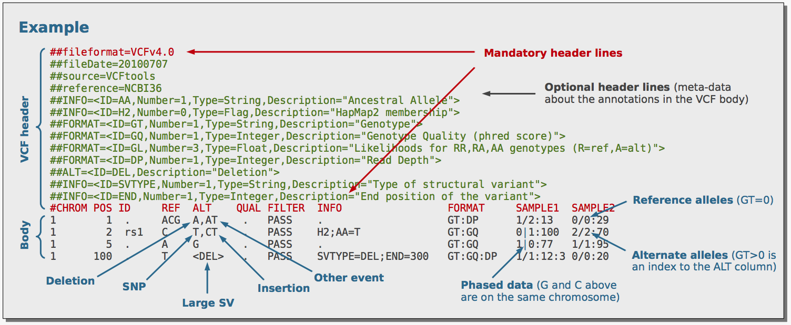

Table of Contents
=================

* [Learning the VCF format](#learning-the-vcf-format)
   * [Introduction](#introduction)
   * [Installation](#installation)
   * [Creating VCF example files](#creating-vcf-example-files)
   * [Usage](#usage)
   * [VCF to BCF and other conversions](#vcf-to-bcf-and-other-conversions)
   * [Viewing a VCF/BCF file](#viewing-a-vcfbcf-file)
   * [Comparing output types](#comparing-output-types)
   * [Filtering for different types of mutations](#filtering-for-different-types-of-mutations)
   * [VCF to PED](#vcf-to-ped)
   * [VCF to BED](#vcf-to-bed)
   * [Extracting INFO field/s](#extracting-info-fields)
   * [Filtering VCF on the FILTER column](#filtering-vcf-on-the-filter-column)
   * [Filtering VCF file using the INFO field/s](#filtering-vcf-file-using-the-info-fields)
   * [Summarise SNPs and INDELs per sample](#summarise-snps-and-indels-per-sample)
   * [Add AF tag to a VCF file](#add-af-tag-to-a-vcf-file)
   * [Check whether the REF sequence is correct](#check-whether-the-ref-sequence-is-correct)
   * [Random subset of variants](#random-subset-of-variants)
   * [Index a VCF file](#index-a-vcf-file)
   * [Subset variants within a specific genomic region](#subset-variants-within-a-specific-genomic-region)
   * [Output sample names](#output-sample-names)
   * [Subset sample/s from a multi-sample VCF file](#subset-samples-from-a-multi-sample-vcf-file)
   * [Merging VCF files](#merging-vcf-files)
   * [Decomposing and normalising variants](#decomposing-and-normalising-variants)
   * [Comparing VCF files](#comparing-vcf-files)
   * [Visualisation](#visualisation)
   * [Useful links](#useful-links)
   * [Stargazers over time](#stargazers-over-time)

Created by [gh-md-toc](https://github.com/ekalinin/github-markdown-toc)

Mon 21 Feb 2022 11:48:42 PM UTC

Learning the VCF format
================

## Introduction


Natural selection occurs under three conditions:

1.  Genetic variation occurs among individuals (and this occurs mainly
    due to chance errors in replication)
2.  The genetic variation must be heritable, i.e. passed from one
    generation to the next, and
3.  The genetic variation results in varying fitness, i.e. individuals
    survive and reproduce with respect to genetic variation

The *de facto* file format for storing genetic variation is the Variant
Call Format (VCF) and was developed under the [1000 Genomes
Project](https://pubmed.ncbi.nlm.nih.gov/21653522/). Currently, the
Large Scale Genomics work stream of the Global Alliance for Genomics &
Health (GA4GH) maintain the specification of the VCF (and other
[high-throughput sequencing data
formats](https://samtools.github.io/hts-specs/)). A good starting point
for learning about the VCF is this
[poster](http://vcftools.sourceforge.net/VCF-poster.pdf) and a portion
of the poster is displayed below.



Initially, VCFtools (and the associated scripts) was used for working
with VCF files. VCFtools was also developed by the 1000 Genomes Project
team but the [tool](https://github.com/vcftools/vcftools) does not seem
to be actively maintained anymore. As VCF files are simply tab-delimited
flat files, they are slow to process and the BCF was implemented, which
is a more efficient format for data processing. A BCF file is the binary
equivalent of a VCF file, akin to the SAM and BAM formats and
[BCFtools](https://github.com/samtools/bcftools) is used to work with
BCF (and VCF) files. BCFtools is actively maintained and therefore
should be used instead of VCFtools. To learn more about BCFtools (and
SAMtools), check out the paper [Twelve years of SAMtools and
BCFtools](https://academic.oup.com/gigascience/article/10/2/giab008/6137722)
and please cite it if you use BCFtools for your work.

## Installation

The easiest way to install BCFtools is by using
[Conda](https://docs.conda.io/en/latest/) (and I recommend using
[Miniconda](https://docs.conda.io/en/latest/miniconda.html)).

``` bash
conda install -c bioconda bcftools
```

It is also relatively straightforward to compile on Linux (if your
system has all the prerequisites). The following code will install
BCFtools (and HTSlib and SAMtools, which you will most likely be using
as well) into the directory specified by `dir=`.

``` bash
dir=$HOME/tools

ver=1.14
for tool in htslib bcftools samtools; do
   check=${tool}
   if [[ ${tool} == htslib ]]; then
      check=bgzip
   fi
   if [[ ! -e ${dir}/bin/${check} ]]; then
      url=https://github.com/samtools/${tool}/releases/download/${ver}/${tool}-${ver}.tar.bz2
      wget ${url}
      tar xjf ${tool}-${ver}.tar.bz2
      cd ${tool}-${ver}
      ./configure --prefix=${dir}
      make && make install
      cd ..
      rm -rf ${tool}-${ver}*
   fi
done
```

## Creating VCF example files

Example VCF files were generated to test the functionality of BCFtool
and other VCF tools. The `aln.bt.vcf.gz`, `aln.hc.vcf.gz`, and
`aln.fb.vcf.gz` VCF files were generated using a simple workflow
implemented in [Groovy](http://www.groovy-lang.org/) and processed by
[Bpipe](https://github.com/ssadedin/bpipe), a tool for running
bioinformatics workflows. You can view the workflow in
`workflow/simple/pipeline.groovy`, which carries out the following
steps: (i) a random reference sequence is generated, (ii) the reference
sequence is mutated, (iii) reads are derived from the mutated reference
then (iv) mapped back to the original non-mutated reference (v) and
finally variants are called using three separate tools: BCFtools,
HaplotypeCaller, and freebayes. Additional information is available in
this [blog
post](http://davetang.org/muse/2015/06/04/paired-end-alignment-using-bpipe/).

To run this workflow for yourself, run the following commands:

``` bash
git clone https://github.com/davetang/learning_vcf_file.git

# installs the necessary tools
cd workflow && ./install.sh

# run the workflow using Bpipe
cd simple && make
```

If you want to play around with different parameters, simply edit the
variables at the start of `workflow/simple/pipeline.groovy`. The status
of this workflow is checked by [GitHub
Actions](https://github.com/features/actions) and on successful
completion the final variant calls are copied to the `eg` folder; please
refer to `.github/workflows/variant_call.yml` for more details.

## Usage

Running `bcftools` without any parameters will output the usage and the
subcommands. (The `--help` option is used below to avoid an exit code of
1 since this README is generated programmatically.)

``` bash
bcftools --help
```

    ## 
    ## Program: bcftools (Tools for variant calling and manipulating VCFs and BCFs)
    ## Version: 1.15 (using htslib 1.15)
    ## 
    ## Usage:   bcftools [--version|--version-only] [--help] <command> <argument>
    ## 
    ## Commands:
    ## 
    ##  -- Indexing
    ##     index        index VCF/BCF files
    ## 
    ##  -- VCF/BCF manipulation
    ##     annotate     annotate and edit VCF/BCF files
    ##     concat       concatenate VCF/BCF files from the same set of samples
    ##     convert      convert VCF/BCF files to different formats and back
    ##     head         view VCF/BCF file headers
    ##     isec         intersections of VCF/BCF files
    ##     merge        merge VCF/BCF files files from non-overlapping sample sets
    ##     norm         left-align and normalize indels
    ##     plugin       user-defined plugins
    ##     query        transform VCF/BCF into user-defined formats
    ##     reheader     modify VCF/BCF header, change sample names
    ##     sort         sort VCF/BCF file
    ##     view         VCF/BCF conversion, view, subset and filter VCF/BCF files
    ## 
    ##  -- VCF/BCF analysis
    ##     call         SNP/indel calling
    ##     consensus    create consensus sequence by applying VCF variants
    ##     cnv          HMM CNV calling
    ##     csq          call variation consequences
    ##     filter       filter VCF/BCF files using fixed thresholds
    ##     gtcheck      check sample concordance, detect sample swaps and contamination
    ##     mpileup      multi-way pileup producing genotype likelihoods
    ##     roh          identify runs of autozygosity (HMM)
    ##     stats        produce VCF/BCF stats
    ## 
    ##  -- Plugins (collection of programs for calling, file manipulation & analysis)
    ##     38 plugins available, run "bcftools plugin -lv" to see a complete list
    ## 
    ##  Most commands accept VCF, bgzipped VCF, and BCF with the file type detected
    ##  automatically even when streaming from a pipe. Indexed VCF and BCF will work
    ##  in all situations. Un-indexed VCF and BCF and streams will work in most but
    ##  not all situations.

## VCF to BCF and other conversions

Use `bcftools view` or `bcftools convert` to make conversions and use
`--output-type u` or `--output-type b` for uncompressed and compressed
BCF, respectively.

``` bash
bcftools view -O u eg/aln.bt.vcf.gz > eg/aln.bt.un.bcf
bcftools view -O b eg/aln.bt.vcf.gz > eg/aln.bt.bcf

# uncompressed VCF
bcftools convert -O v eg/aln.bt.vcf.gz > eg/aln.bt.vcf
```

`bcftools convert` has more conversion options such as converting gVCF
to VCF and converting VCFs from `IMPUTE2` and `SHAPEIT`.

## Viewing a VCF/BCF file

Use `bcftools view` to view a VCF, bgzipped VCF, or BCF file; BCFtools
will automatically detect the format.

Viewing a VCF file.

``` bash
bcftools view eg/aln.bt.vcf | grep -v "^#" | head -2
```

    ## 1000000  151 .   T   A   225.417 .   DP=92;VDB=0.696932;SGB=-0.693147;FS=0;MQ0F=0;AC=2;AN=2;DP4=0,0,90,0;MQ=60   GT:PL   1/1:255,255,0
    ## 1000000  172 .   TAA TA  142.185 .   INDEL;IDV=75;IMF=0.914634;DP=82;VDB=0.712699;SGB=-0.693147;RPBZ=-4.35727;MQBZ=0;SCBZ=0;FS=0;MQ0F=0;AC=2;AN=2;DP4=7,0,75,0;MQ=60 GT:PL   1/1:169,117,0

Viewing a bgzipped VCF file.

``` bash
bcftools view eg/aln.bt.vcf.gz | grep -v "^#" | head -2
```

    ## 1000000  151 .   T   A   225.417 .   DP=92;VDB=0.696932;SGB=-0.693147;FS=0;MQ0F=0;AC=2;AN=2;DP4=0,0,90,0;MQ=60   GT:PL   1/1:255,255,0
    ## 1000000  172 .   TAA TA  142.185 .   INDEL;IDV=75;IMF=0.914634;DP=82;VDB=0.712699;SGB=-0.693147;RPBZ=-4.35727;MQBZ=0;SCBZ=0;FS=0;MQ0F=0;AC=2;AN=2;DP4=7,0,75,0;MQ=60 GT:PL   1/1:169,117,0

Viewing a BCF file.

``` bash
bcftools view eg/aln.bt.vcf.gz | grep -v "^#" | head -2
```

    ## 1000000  151 .   T   A   225.417 .   DP=92;VDB=0.696932;SGB=-0.693147;FS=0;MQ0F=0;AC=2;AN=2;DP4=0,0,90,0;MQ=60   GT:PL   1/1:255,255,0
    ## 1000000  172 .   TAA TA  142.185 .   INDEL;IDV=75;IMF=0.914634;DP=82;VDB=0.712699;SGB=-0.693147;RPBZ=-4.35727;MQBZ=0;SCBZ=0;FS=0;MQ0F=0;AC=2;AN=2;DP4=7,0,75,0;MQ=60 GT:PL   1/1:169,117,0

If you want to omit the header but do not want to type `grep -v "^#"`,
you can use the `-H` option instead.

``` bash
bcftools view -H eg/aln.bt.vcf.gz | head -2
```

    ## 1000000  151 .   T   A   225.417 .   DP=92;VDB=0.696932;SGB=-0.693147;FS=0;MQ0F=0;AC=2;AN=2;DP4=0,0,90,0;MQ=60   GT:PL   1/1:255,255,0
    ## 1000000  172 .   TAA TA  142.185 .   INDEL;IDV=75;IMF=0.914634;DP=82;VDB=0.712699;SGB=-0.693147;RPBZ=-4.35727;MQBZ=0;SCBZ=0;FS=0;MQ0F=0;AC=2;AN=2;DP4=7,0,75,0;MQ=60 GT:PL   1/1:169,117,0

## Comparing output types

The four output types will be compared on a VCF file produced by the
1000 Genomes Project.

1.  Compressed BCF (b)
2.  Uncompressed BCF (u)
3.  Compressed VCF (z)
4.  Uncompressed VCF (v).

Download and unzip.

``` bash
wget --quiet https://davetang.org/file/ALL.chr1.phase3_shapeit2_mvncall_integrated_v5_related_samples.20130502.genotypes.vcf.gz -O eg/1kgp.vcf.gz
gunzip eg/1kgp.vcf.gz
```

VCF to compressed BCF.

``` bash
time bcftools convert --threads 2 -O b -o eg/1kgp.bcf eg/1kgp.vcf
```

    ## 
    ## real 0m18.811s
    ## user 0m30.255s
    ## sys  0m2.099s

VCF to uncompressed BCF.

``` bash
time bcftools convert --threads 2 -O u -o eg/1kgp.un.bcf eg/1kgp.vcf
```

    ## 
    ## real 0m17.118s
    ## user 0m30.510s
    ## sys  0m2.039s

VCF to compressed VCF.

``` bash
time bcftools convert --threads 2 -O z -o eg/1kgp.vcf.gz eg/1kgp.vcf
```

    ## 
    ## real 0m25.595s
    ## user 0m41.674s
    ## sys  0m2.947s

File sizes

``` bash
du -h eg/1kgp.*
```

    ## 85M  eg/1kgp.bcf
    ## 85M  eg/1kgp.un.bcf
    ## 1.5G eg/1kgp.vcf
    ## 84M  eg/1kgp.vcf.gz

## Filtering for different types of mutations

Use the `bcftools view` subcommand to subset specific types of variants.

    -v/V, --types/--exclude-types LIST     Select/exclude comma-separated list of variant types: snps,indels,mnps,ref,bnd,other [null]

SNPs.

``` bash
bcftools view -v snps eg/1kgp.bcf | grep -v "^#" | cut -f1-8 | head -2
```

    ## 1    10505   .   A   T   100 PASS    AC=0;AN=62;NS=31;AF=0.000199681;SAS_AF=0;EUR_AF=0;AFR_AF=0.0008;AMR_AF=0;EAS_AF=0
    ## 1    10506   .   C   G   100 PASS    AC=0;AN=62;NS=31;AF=0.000199681;SAS_AF=0;EUR_AF=0;AFR_AF=0.0008;AMR_AF=0;EAS_AF=0

Indels.

``` bash
bcftools view -v indels eg/1kgp.bcf | grep -v "^#" | cut -f1-8 | head -2
```

    ## 1    10177   .   A   AC  100 PASS    AC=19;AN=62;NS=31;AF=0.425319;SAS_AF=0.4949;EUR_AF=0.4056;AFR_AF=0.4909;AMR_AF=0.3602;EAS_AF=0.3363
    ## 1    10235   .   T   TA  100 PASS    AC=0;AN=62;NS=31;AF=0.00119808;SAS_AF=0.0051;EUR_AF=0;AFR_AF=0;AMR_AF=0.0014;EAS_AF=0

[Multiple Nucleotide
Polymorphisms](https://genome.sph.umich.edu/wiki/Variant_classification#Definitions):
The reference and alternate sequences are of the same length and have to
be greater than 1 and all nucleotides in the sequences differ from one
another.

``` bash
bcftools view -H -v mnps eg/ex.vcf | grep -v "^#"
```

    ## 1    25563113    .   CC  GG  .   PASS    AC=1;AF=0.5;AN=2;BaseQRankSum=2.621;DB;DP=20;FS=0;HRun=0;HaplotypeScore=101.749;MQ0=0;MQ=55.8;MQRankSum=-1.91;QD=11.05;ReadPosRankSum=0.4;set=variant   GT:AD:DP:GQ:PL  0/1:14,6:20:99:260,0,486    0/0:14,6:20:99:260,0,486    1/1:14,6:20:99:260,0,486

Not sure what `ref` refers to but possibly structural variants. `INS:ME`
refers to an insertion of a mobile element relative to the reference and
the `<CN#>` refers to `Copy number allele: # copies` according to the
VCF header.

``` bash
bcftools view -v ref eg/1kgp.bcf | grep -v "^#" | cut -f1-8 | head -3
```

    ## 1    645710  ALU_umary_ALU_2 A   <INS:ME:ALU>    100 PASS    AC=0;AN=62;CS=ALU_umary;MEINFO=AluYa4_5,1,223,-;NS=31;SVLEN=222;SVTYPE=ALU;TSD=null;AF=0.00698882;SAS_AF=0.0041;EUR_AF=0.0189;AFR_AF=0;AMR_AF=0.0072;EAS_AF=0.0069
    ## 1    668630  DUP_delly_DUP20532  G   <CN2>   100 PASS    AC=2;AN=62;CIEND=-150,150;CIPOS=-150,150;CS=DUP_delly;END=850204;NS=31;SVLEN=181574;SVTYPE=DUP;IMPRECISE;AF=0.0127796;SAS_AF=0.001;EUR_AF=0.001;AFR_AF=0.0015;AMR_AF=0;EAS_AF=0.0595
    ## 1    713044  DUP_gs_CNV_1_713044_755966  C   <CN0>,<CN2> 100 PASS    AC=0,2;AN=62;CS=DUP_gs;END=755966;NS=31;SVTYPE=CNV;AF=0.000599042,0.0411342;SAS_AF=0,0.045;EUR_AF=0.001,0.0417;AFR_AF=0,0.0303;AMR_AF=0.0014,0.0259;EAS_AF=0.001,0.0615

Breakends (no variants of this class).

``` bash
bcftools view -H -v bnd eg/1kgp.bcf
```

Others.

``` bash
bcftools view -v other eg/1kgp.bcf | grep -v "^#" | cut -f1-8 | head -3
```

    ## 1    645710  ALU_umary_ALU_2 A   <INS:ME:ALU>    100 PASS    AC=0;AN=62;CS=ALU_umary;MEINFO=AluYa4_5,1,223,-;NS=31;SVLEN=222;SVTYPE=ALU;TSD=null;AF=0.00698882;SAS_AF=0.0041;EUR_AF=0.0189;AFR_AF=0;AMR_AF=0.0072;EAS_AF=0.0069
    ## 1    668630  DUP_delly_DUP20532  G   <CN2>   100 PASS    AC=2;AN=62;CIEND=-150,150;CIPOS=-150,150;CS=DUP_delly;END=850204;NS=31;SVLEN=181574;SVTYPE=DUP;IMPRECISE;AF=0.0127796;SAS_AF=0.001;EUR_AF=0.001;AFR_AF=0.0015;AMR_AF=0;EAS_AF=0.0595
    ## 1    713044  DUP_gs_CNV_1_713044_755966  C   <CN0>,<CN2> 100 PASS    AC=0,2;AN=62;CS=DUP_gs;END=755966;NS=31;SVTYPE=CNV;AF=0.000599042,0.0411342;SAS_AF=0,0.045;EUR_AF=0.001,0.0417;AFR_AF=0,0.0303;AMR_AF=0.0014,0.0259;EAS_AF=0.001,0.0615

## VCF to PED

See my [blog post](http://davetang.org/muse/2016/07/28/vcf-to-ped/).

## VCF to BED

VCF to [Browser Extensible
Data](https://www.genome.ucsc.edu/FAQ/FAQformat.html#format1) format and
not [Binary PED](http://zzz.bwh.harvard.edu/plink/data.shtml#bed)
format; for Binary PED, see the `plink` directory in this repo. For
Browser Extensible Data use
[BEDOPS](https://bedops.readthedocs.io/en/latest/index.html),
specifically the
[vcf2bed](https://bedops.readthedocs.io/en/latest/content/reference/file-management/conversion/vcf2bed.html)
tool.

Install using Conda from
[Bioconda](https://anaconda.org/bioconda/bedops).

``` bash
conda install -c bioconda bedops
```

Check out example file.

``` bash
cat eg/ex.vcf | grep -v "^#" | cut -f1-6
```

    ## 1    866511  rs60722469  C   CCCCT   258.62
    ## 1    884091  rs7522415   C   G   65.46
    ## 1    897730  rs7549631   C   T   225.34
    ## 1    1158562 rs57524763  AAC A   220.99
    ## 1    25563113    .   CC  GG  .

Convert to BED.

``` bash
vcf2bed < eg/ex.vcf | cut -f1-3
```

    ## 1    866510  866511
    ## 1    884090  884091
    ## 1    897729  897730
    ## 1    1158561 1158562
    ## 1    25563112    25563113

Note above that the deletion (rs57524763) only has 1 nucleotide but the
reference should be 3 nucleotides long. Use `--deletions` to have the
coordinates reflect the length of the reference sequence (and to only
report deletions).

``` bash
vcf2bed --deletions < eg/ex.vcf | cut -f1-3
```

    ## 1    1158561 1158564

There is also the insertions option to report only insertions

``` bash
vcf2bed --insertions < eg/ex.vcf | cut -f1-3
```

    ## 1    866510  866511

To report SNVs use `snvs` but note the tool reports the MNP as a SNV and
the reference length is not 2 nucleotides long.

``` bash
vcf2bed --snvs < eg/ex.vcf | cut -f1-3
```

    ## 1    884090  884091
    ## 1    897729  897730
    ## 1    25563112    25563113

## Extracting INFO field/s

The VCF has various information fields; use the `query` subcommand to
extract specific field/s.

``` bash
bcftools query -f 'DP=%DP\tAN=%AN\tAC=%AC\tMQ=%MQ\n' eg/aln.bt.vcf.gz | head -3
```

    ## DP=92    AN=2    AC=2    MQ=60
    ## DP=82    AN=2    AC=2    MQ=60
    ## DP=109   AN=2    AC=2    MQ=60

Combining with the `view` subcommand:

``` bash
bcftools view -v snps eg/aln.bt.vcf.gz | bcftools query -f 'DP=%DP\tAN=%AN\tAC=%AC\tMQ=%MQ\n' - | head -3
```

    ## DP=92    AN=2    AC=2    MQ=60
    ## DP=109   AN=2    AC=2    MQ=60
    ## DP=102   AN=2    AC=2    MQ=60

## Filtering VCF on the FILTER column

Use `bcftools view` to keep variants that have a “PASS” in the FILTER
column.

    -f,   --apply-filters <list> require at least one of the listed FILTER strings (e.g. "PASS,.")

``` bash
bcftools view -H -f PASS eg/1kgp.bcf | head -3
```

    ## 1    10177   .   A   AC  100 PASS    AC=19;AN=62;NS=31;AF=0.425319;SAS_AF=0.4949;EUR_AF=0.4056;AFR_AF=0.4909;AMR_AF=0.3602;EAS_AF=0.3363 GT  0|1 0|0 0|0 0|0 1|0 0|0 1|0 0|1 0|0 0|0 0|0 0|0 0|1 0|0 0|1 0|1 1|0 0|1 0|1 0|0 0|0 0|1 0|0 1|0 0|1 1|0 0|0 1|1 1|1 0|0 0|1
    ## 1    10235   .   T   TA  100 PASS    AC=0;AN=62;NS=31;AF=0.00119808;SAS_AF=0.0051;EUR_AF=0;AFR_AF=0;AMR_AF=0.0014;EAS_AF=0   GT  0|0 0|0 0|0 0|0 0|0 0|0 0|0 0|0 0|0 0|0 0|0 0|0 0|0 0|0 0|0 0|0 0|0 0|0 0|0 0|0 0|0 0|0 0|0 0|0 0|0 0|0 0|0 0|0 0|0 0|0 0|0
    ## 1    10352   .   T   TA  100 PASS    AC=28;AN=62;NS=31;AF=0.4375;SAS_AF=0.4192;EUR_AF=0.4264;AFR_AF=0.4788;AMR_AF=0.4107;EAS_AF=0.4306   GT  1|0 0|1 1|1 0|0 1|0 1|0 1|0 1|0 0|0 1|0 1|0 1|0 0|0 0|1 1|0 0|0 1|0 1|1 0|1 0|0 1|0 0|1 1|0 1|0 1|0 0|1 0|1 1|0 0|1 1|0 1|0

## Filtering VCF file using the INFO field/s

Use `bcftools filter`.

``` bash
bcftools filter -s "Depth200" -e "DP<200" eg/aln.bt.vcf.gz | grep -v "^#" | head -3
```

    ## 1000000  151 .   T   A   225.417 Depth200    DP=92;VDB=0.696932;SGB=-0.693147;FS=0;MQ0F=0;AC=2;AN=2;DP4=0,0,90,0;MQ=60   GT:PL   1/1:255,255,0
    ## 1000000  172 .   TAA TA  142.185 Depth200    INDEL;IDV=75;IMF=0.914634;DP=82;VDB=0.712699;SGB=-0.693147;RPBZ=-4.35727;MQBZ=0;SCBZ=0;FS=0;MQ0F=0;AC=2;AN=2;DP4=7,0,75,0;MQ=60 GT:PL   1/1:169,117,0
    ## 1000000  336 .   A   G   225.417 Depth200    DP=109;VDB=0.972083;SGB=-0.693147;FS=0;MQ0F=0;AC=2;AN=2;DP4=0,0,108,0;MQ=60 GT:PL   1/1:255,255,0

``` bash
bcftools filter -s "Depth200&VDB" -e "DP<200 & VDB<0.9" eg/aln.bt.vcf.gz | grep -v "^#" | head -3
```

    ## 1000000  151 .   T   A   225.417 Depth200&VDB    DP=92;VDB=0.696932;SGB=-0.693147;FS=0;MQ0F=0;AC=2;AN=2;DP4=0,0,90,0;MQ=60   GT:PL   1/1:255,255,0
    ## 1000000  172 .   TAA TA  142.185 Depth200&VDB    INDEL;IDV=75;IMF=0.914634;DP=82;VDB=0.712699;SGB=-0.693147;RPBZ=-4.35727;MQBZ=0;SCBZ=0;FS=0;MQ0F=0;AC=2;AN=2;DP4=7,0,75,0;MQ=60 GT:PL   1/1:169,117,0
    ## 1000000  336 .   A   G   225.417 PASS    DP=109;VDB=0.972083;SGB=-0.693147;FS=0;MQ0F=0;AC=2;AN=2;DP4=0,0,108,0;MQ=60 GT:PL   1/1:255,255,0

## Summarise SNPs and INDELs per sample

Use `bcftools stats` with the `-s -` parameter. The example VCF file
`eg/ex.vcf` has four variants across three samples (one, two, and
three).

  - Sample one has two SNPs (both het) and one deletion (het)
  - Sample two has two SNPs (one het and one hom alt) and insertion
    (het)
  - Sample three has one SNP (het) and one insertion (hom alt) and one
    deletion (hom alt)

You can confirm the numbers from the stats output.

``` bash
cat eg/ex.vcf | grep -v "^#"
```

    ## 1    866511  rs60722469  C   CCCCT   258.62  PASS    AC=2;AF=1.00;AN=2;DB;DP=11;FS=0.000;HRun=0;HaplotypeScore=41.3338;MQ0=0;MQ=61.94;QD=23.51;set=variant   GT:AD:DP:GQ:PL  0/0:6,5:11:14.79:300,15,0   0/1:6,5:11:14.79:300,15,0   1/1:6,5:11:14.79:300,15,0
    ## 1    884091  rs7522415   C   G   65.46   PASS    AC=1;AF=0.50;AN=2;BaseQRankSum=-0.259;DB;DP=12;Dels=0.00;FS=0.000;HRun=1;HaplotypeScore=0.0000;MQ0=0;MQ=53.22;MQRankSum=0.779;QD=5.45;ReadPosRankSum=2.047;set=variant2 GT:AD:DP:GQ:PL  0/1:6,6:12:95.45:95,0,123   1/1:6,6:12:95.45:95,0,123   0/0:6,6:12:95.45:95,0,123
    ## 1    897730  rs7549631   C   T   225.34  PASS    AC=1;AF=0.50;AN=2;BaseQRankSum=-2.218;DB;DP=21;Dels=0.00;FS=6.419;HRun=1;HaplotypeScore=1.8410;MQ0=0;MQ=58.89;MQRankSum=-0.387;QD=10.73;ReadPosRankSum=-0.880;set=variant2  GT:AD:DP:GQ:PL  0/1:11,10:21:99:255,0,348   0/1:11,10:21:99:255,0,348   0/1:11,10:21:99:255,0,348
    ## 1    1158562 rs57524763  AAC A   220.99  PASS    AC=1;AF=0.50;AN=2;BaseQRankSum=2.621;DB;DP=20;FS=0.000;HRun=0;HaplotypeScore=101.7487;MQ0=0;MQ=55.80;MQRankSum=-1.910;QD=11.05;ReadPosRankSum=0.400;set=variant GT:AD:DP:GQ:PL  0/1:14,6:20:99:260,0,486    0/0:14,6:20:99:260,0,486    1/1:14,6:20:99:260,0,486
    ## 1    25563113    .   CC  GG  .   PASS    AC=1;AF=0.50;AN=2;BaseQRankSum=2.621;DB;DP=20;FS=0.000;HRun=0;HaplotypeScore=101.7487;MQ0=0;MQ=55.80;MQRankSum=-1.910;QD=11.05;ReadPosRankSum=0.400;set=variant GT:AD:DP:GQ:PL  0/1:14,6:20:99:260,0,486    0/0:14,6:20:99:260,0,486    1/1:14,6:20:99:260,0,486

``` bash
bcftools stats -s - eg/ex.vcf | grep -A 4 "Per-sample counts"
```

    ## # PSC, Per-sample counts. Note that the ref/het/hom counts include only SNPs, for indels see PSI. The rest include both SNPs and indels.
    ## # PSC    [2]id   [3]sample   [4]nRefHom  [5]nNonRefHom   [6]nHets    [7]nTransitions [8]nTransversions   [9]nIndels  [10]average depth   [11]nSingletons [12]nHapRef [13]nHapAlt [14]nMissing
    ## PSC  0   one 1   0   2   1   1   1   16.8    0   0   0   0
    ## PSC  0   two 2   1   1   1   1   1   16.8    0   0   0   0
    ## PSC  0   three   1   0   1   1   0   2   16.8    0   0   0   0

``` bash
bcftools stats -s - eg/ex.vcf | grep -A 4 "Per-Sample Indels"
```

    ## # PSI, Per-Sample Indels. Note that alt-het genotypes with both ins and del allele are counted twice, in both nInsHets and nDelHets.
    ## # PSI    [2]id   [3]sample   [4]in-frame [5]out-frame    [6]not applicable   [7]out/(in+out) ratio   [8]nInsHets [9]nDelHets [10]nInsAltHoms [11]nDelAltHoms
    ## PSI  0   one 0   0   0   0.00    0   1   0   0
    ## PSI  0   two 0   0   0   0.00    1   0   0   0
    ## PSI  0   three   0   0   0   0.00    0   0   1   1

## Add AF tag to a VCF file

The allele frequency tag (AF) is missing from the VCF file generated by
`BCFtools call`.

``` bash
bcftools view -H eg/aln.bt.vcf.gz | head -1
```

    ## 1000000  151 .   T   A   225.417 .   DP=92;VDB=0.696932;SGB=-0.693147;FS=0;MQ0F=0;AC=2;AN=2;DP4=0,0,90,0;MQ=60   GT:PL   1/1:255,255,0

The `fill-tags` plugin can add additional tags to a VCF file including
the AF tag.

``` bash
bcftools plugin fill-tags eg/aln.bt.vcf.gz | grep -v "^#" | head -1
```

    ## 1000000  151 .   T   A   225.417 .   DP=92;VDB=0.696932;SGB=-0.693147;FS=0;MQ0F=0;AC=2;AN=2;DP4=0,0,90,0;MQ=60;NS=1;AF=1;MAF=0;AC_Het=0;AC_Hom=2;AC_Hemi=0;HWE=1;ExcHet=1    GT:PL   1/1:255,255,0

## Check whether the REF sequence is correct

Change the reference sequence of variant at position 151 to G.

``` bash
zcat eg/aln.bt.vcf.gz | perl -lane 'if($F[1] == 151){ $F[3] = G; print join("\t", @F) } else { print }' > eg/incorrect.vcf
```

Use `bcftools norm` with `-c` to check whether the REF sequence is
correct.

``` bash
bcftools norm -f eg/test_31.fa -c w eg/incorrect.vcf > /dev/null
```

    ## REF_MISMATCH 1000000 151 G   T
    ## Lines   total/split/realigned/skipped:   10022/0/851/0

## Random subset of variants

Total number of variants.

``` bash
bcftools view -H eg/aln.bt.vcf.gz | wc -l
```

    ## 10022

A random sample can be achieved by using a Perl one-liner. In the
example below, the `srand` function sets the seed (for reproducibility)
and the float controls how many variants are outputted (1%). (Note that
the use of `grep -v "^#"` is only line counting purposes.)

``` bash
bcftools view eg/aln.bt.vcf.gz | perl -nle 'BEGIN { srand(1984) } if (/^#/){ print; next }; print if rand(1) < 0.01' | grep -v "^#" | wc -l
```

    ## 106

Sub-sample 1% and save as BCF file.

``` bash
bcftools view eg/aln.bt.vcf.gz | perl -nle 'BEGIN { srand(1984) } if (/^#/){ print; next }; print if rand(1) < 0.01' | bcftools view -O b - -o eg/aln.bt.ss.bcf
```

Sample 10%.

``` bash
bcftools view eg/aln.bt.vcf.gz | perl -nle 'BEGIN { srand(1984) } if (/^#/){ print; next }; print if rand(1) < 0.1' | grep -v "^#" | wc -l
```

    ## 1019

## Index a VCF file

An index is required for several tasks such as [subsetting
variants](#subset-variants-within-a-specific-genomic-region). Using
either `bcftools index` or `tabix` seems to be fine, although they
generate indexes with different suffixes.

Using `bcftools index` to generate a `csi` index.

``` bash
bcftools index eg/aln.hc.vcf.gz
bcftools view -H -r 1000000:100-1000 eg/aln.hc.vcf.gz
rm eg/aln.hc.vcf.gz.csi
```

    ## 1000000  151 .   T   A   4111.06 .   AC=2;AF=1;AN=2;DP=100;ExcessHet=0;FS=0;MLEAC=2;MLEAF=1;MQ=60;QD=25.36;SOR=9.065 GT:AD:DP:GQ:PL  1/1:0,92:92:99:4125,277,0
    ## 1000000  172 .   TA  T   3122.03 .   AC=2;AF=1;AN=2;DP=89;ExcessHet=0;FS=0;MLEAC=2;MLEAF=1;MQ=60;QD=28.73;SOR=8.909  GT:AD:DP:GQ:PL  1/1:0,85:85:99:3136,256,0
    ## 1000000  336 .   A   G   4884.06 .   AC=2;AF=1;AN=2;DP=115;ExcessHet=0;FS=0;MLEAC=2;MLEAF=1;MQ=60;QD=30.97;SOR=9.401 GT:AD:DP:GQ:PL  1/1:0,109:109:99:4898,328,0
    ## 1000000  415 .   C   A   4569.06 .   AC=2;AF=1;AN=2;DP=106;ExcessHet=0;FS=0;MLEAC=2;MLEAF=1;MQ=60;QD=27.24;SOR=3.442 GT:AD:DP:GQ:PL  1/1:0,102:102:99:4583,307,0
    ## 1000000  733 .   G   T   9279.06 .   AC=2;AF=1;AN=2;DP=215;ExcessHet=0;FS=0;MLEAC=2;MLEAF=1;MQ=60;QD=28.2;SOR=0.814  GT:AD:DP:GQ:PL  1/1:0,208:208:99:9293,626,0

Using `tabix` to generate a `tbi` index.

``` bash
tabix eg/aln.hc.vcf.gz
bcftools view -H -r 1000000:100-1000 eg/aln.hc.vcf.gz
rm eg/aln.hc.vcf.gz.tbi
```

    ## 1000000  151 .   T   A   4111.06 .   AC=2;AF=1;AN=2;DP=100;ExcessHet=0;FS=0;MLEAC=2;MLEAF=1;MQ=60;QD=25.36;SOR=9.065 GT:AD:DP:GQ:PL  1/1:0,92:92:99:4125,277,0
    ## 1000000  172 .   TA  T   3122.03 .   AC=2;AF=1;AN=2;DP=89;ExcessHet=0;FS=0;MLEAC=2;MLEAF=1;MQ=60;QD=28.73;SOR=8.909  GT:AD:DP:GQ:PL  1/1:0,85:85:99:3136,256,0
    ## 1000000  336 .   A   G   4884.06 .   AC=2;AF=1;AN=2;DP=115;ExcessHet=0;FS=0;MLEAC=2;MLEAF=1;MQ=60;QD=30.97;SOR=9.401 GT:AD:DP:GQ:PL  1/1:0,109:109:99:4898,328,0
    ## 1000000  415 .   C   A   4569.06 .   AC=2;AF=1;AN=2;DP=106;ExcessHet=0;FS=0;MLEAC=2;MLEAF=1;MQ=60;QD=27.24;SOR=3.442 GT:AD:DP:GQ:PL  1/1:0,102:102:99:4583,307,0
    ## 1000000  733 .   G   T   9279.06 .   AC=2;AF=1;AN=2;DP=215;ExcessHet=0;FS=0;MLEAC=2;MLEAF=1;MQ=60;QD=28.2;SOR=0.814  GT:AD:DP:GQ:PL  1/1:0,208:208:99:9293,626,0

## Subset variants within a specific genomic region

Use `bcftools view` with `-r` or `-R`, which requires an index file. You
can use `bcftools view` with `-t` or `-T`, which does not require an
index file, but is much slower because the entire file is streamed.

``` bash
tabix -f eg/1kgp.bcf
time bcftools view -H -r 1:55000000-56000000 eg/1kgp.bcf | wc -l
```

    ## 31036
    ## 
    ## real 0m0.089s
    ## user 0m0.077s
    ## sys  0m0.037s

`bcftools view` with `-t` streams the entire file, so is much slower.

``` bash
time bcftools view -H -t 1:55000000-56000000 eg/1kgp.bcf | wc -l
```

    ## 31036
    ## 
    ## real 0m3.792s
    ## user 0m3.777s
    ## sys  0m0.040s

Use commas to list more than one loci.

``` bash
bcftools view -H -r 1:10000-50000,1:100000-200000,1:55000000-56000000 eg/1kgp.bcf | wc -l
```

    ## 31382

Or use a BED file to store regions of interest.

``` bash
echo -e "1\t10000\t50000\n1\t100000\t200000\n1\t55000000\t56000000" > eg/regions.bed
bcftools view -H -R eg/regions.bed eg/1kgp.bcf | wc -l
```

    ## 31382

## Output sample names

Use `bcftools query`.

``` bash
bcftools query -l eg/1kgp.vcf.gz | head -5
```

    ## HG00124
    ## HG00501
    ## HG00635
    ## HG00702
    ## HG00733

## Subset sample/s from a multi-sample VCF file

Subset HG00733.

``` bash
bcftools view -s HG00733 eg/1kgp.vcf.gz | grep -v "^##" | head -3
```

    ## #CHROM   POS ID  REF ALT QUAL    FILTER  INFO    FORMAT  HG00733
    ## 1    10177   .   A   AC  100 PASS    AC=1;AN=2;NS=31;AF=0.425319;SAS_AF=0.4949;EUR_AF=0.4056;AFR_AF=0.4909;AMR_AF=0.3602;EAS_AF=0.3363   GT  1|0
    ## 1    10235   .   T   TA  100 PASS    AC=0;AN=2;NS=31;AF=0.00119808;SAS_AF=0.0051;EUR_AF=0;AFR_AF=0;AMR_AF=0.0014;EAS_AF=0    GT  0|0

Subset HG00124, HG00501, HG00635, HG00702, and HG00733.

``` bash
bcftools view -s HG00124,HG00501,HG00635,HG00702,HG00733 eg/1kgp.vcf.gz | grep -v "^##" | head -3
```

    ## #CHROM   POS ID  REF ALT QUAL    FILTER  INFO    FORMAT  HG00124 HG00501 HG00635 HG00702 HG00733
    ## 1    10177   .   A   AC  100 PASS    AC=2;AN=10;NS=31;AF=0.425319;SAS_AF=0.4949;EUR_AF=0.4056;AFR_AF=0.4909;AMR_AF=0.3602;EAS_AF=0.3363  GT  0|1 0|0 0|0 0|0 1|0
    ## 1    10235   .   T   TA  100 PASS    AC=0;AN=10;NS=31;AF=0.00119808;SAS_AF=0.0051;EUR_AF=0;AFR_AF=0;AMR_AF=0.0014;EAS_AF=0   GT  0|0 0|0 0|0 0|0 0|0

## Merging VCF files

Use `bcftools merge` to merge VCF files. [In this
workflow](https://github.com/davetang/sars_cov_2/blob/master/.github/workflows/omicron_variants.yml),
`bcftools merge` was used to create a multi-sample VCF file from
individual VCF files.

``` bash
bcftools merge -o PRJNA784038_illumina.vcf -O v SRR*.vcf.gz
```

## Decomposing and normalising variants

Decomposing can refer to the splitting of multi-allelic variants; we can
use `bcftools norm -m` for this.

``` bash
bcftools view -H eg/PRJNA784038_illumina.vcf.gz | head -2 | cut -f1-5
```

    ## NC_045512.2  4   .   A   T
    ## NC_045512.2  16  .   C   A,G

Splitting.

``` bash
bcftools norm -m- eg/PRJNA784038_illumina.vcf.gz | grep -v "^#" | head -3 | cut -f1-5
```

    ## NC_045512.2  4   .   A   T
    ## NC_045512.2  16  .   C   A
    ## NC_045512.2  16  .   C   G

Decomposing can also refer to converting MNVs into consecutive SNVs;
this is achieved with `bcftools norm -a`.

``` bash
bcftools view -H eg/ex.vcf  | tail -1
```

    ## 1    25563113    .   CC  GG  .   PASS    AC=1;AF=0.5;AN=2;BaseQRankSum=2.621;DB;DP=20;FS=0;HRun=0;HaplotypeScore=101.749;MQ0=0;MQ=55.8;MQRankSum=-1.91;QD=11.05;ReadPosRankSum=0.4;set=variant   GT:AD:DP:GQ:PL  0/1:14,6:20:99:260,0,486    0/0:14,6:20:99:260,0,486    1/1:14,6:20:99:260,0,486

Convert MNV into SNVs.

``` bash
bcftools norm -a eg/ex.vcf | tail -2
```

    ## Lines   total/split/realigned/skipped:   6/0/0/0
    ## 1    25563113    .   C   G   .   PASS    AC=1;AF=0.5;AN=2;BaseQRankSum=2.621;DB;DP=20;FS=0;HRun=0;HaplotypeScore=101.749;MQ0=0;MQ=55.8;MQRankSum=-1.91;QD=11.05;ReadPosRankSum=0.4;set=variant   GT:AD:DP:GQ:PL  0/1:14,6:20:99:260,0,486    0/0:14,6:20:99:260,0,486    1/1:14,6:20:99:260,0,486
    ## 1    25563114    .   C   G   .   PASS    AC=1;AF=0.5;AN=2;BaseQRankSum=2.621;DB;DP=20;FS=0;HRun=0;HaplotypeScore=101.749;MQ0=0;MQ=55.8;MQRankSum=-1.91;QD=11.05;ReadPosRankSum=0.4;set=variant   GT:AD:DP:GQ:PL  0/1:14,6:20:99:260,0,486    0/0:14,6:20:99:260,0,486    1/1:14,6:20:99:260,0,486

Finally, there is also left-aligning, which will be clear by viewing an
example.

``` bash
bcftools view -H eg/aln.bt.vcf.gz | head -2
```

    ## 1000000  151 .   T   A   225.417 .   DP=92;VDB=0.696932;SGB=-0.693147;FS=0;MQ0F=0;AC=2;AN=2;DP4=0,0,90,0;MQ=60   GT:PL   1/1:255,255,0
    ## 1000000  172 .   TAA TA  142.185 .   INDEL;IDV=75;IMF=0.914634;DP=82;VDB=0.712699;SGB=-0.693147;RPBZ=-4.35727;MQBZ=0;SCBZ=0;FS=0;MQ0F=0;AC=2;AN=2;DP4=7,0,75,0;MQ=60 GT:PL   1/1:169,117,0

Left-align.

``` bash
bcftools norm -f eg/test_31.fa eg/aln.bt.vcf.gz | grep -v "^#" | head -2
```

    ## 1000000  151 .   T   A   225.417 .   DP=92;VDB=0.696932;SGB=-0.693147;FS=0;MQ0F=0;AC=2;AN=2;DP4=0,0,90,0;MQ=60   GT:PL   1/1:255,255,0
    ## 1000000  172 .   TA  T   142.185 .   INDEL;IDV=75;IMF=0.914634;DP=82;VDB=0.712699;SGB=-0.693147;RPBZ=-4.35727;MQBZ=0;SCBZ=0;FS=0;MQ0F=0;AC=2;AN=2;DP4=7,0,75,0;MQ=60 GT:PL   1/1:169,117,0

Decomposing and normalising variants are very important steps when
comparing VCF files.

## Comparing VCF files

BCFtools has an intersect tool (`bcftools isec`) that is useful for
comparing VCF files; the tool requires an index.

``` bash
tabix -f eg/aln.bt.vcf.gz
tabix -f eg/aln.hc.vcf.gz

bcftools isec eg/aln.bt.vcf.gz eg/aln.hc.vcf.gz -p comp
```

Four VCF files are produced and `README.txt` explains the contents of
each VCF file.

Records private to `eg/aln.bt.vcf.gz`.

``` bash
bcftools view -H comp/0000.vcf | wc -l
```

    ## 915

Records private to `eg/aln.hc.vcf.gz`.

``` bash
bcftools view -H comp/0001.vcf | wc -l
```

    ## 868

Number of overlap.

``` bash
bcftools view -H comp/0002.vcf | wc -l
```

    ## 9107

[SnpSift](http://snpeff.sourceforge.net/SnpSift.html) is also useful for
comparing VCF files for checking their
[concordance](http://davetang.org/muse/2015/08/26/vcf-concordance/).

## Visualisation

The [vcfR](https://cran.r-project.org/web/packages/vcfR/index.html)
package produces some nice plots.

``` r
install.packages("vcfR")
library(vcfR)

my_vcf <- read.vcfR("~/github/learning_vcf_file/eg/Pfeiffer.vcf", verbose = FALSE)
chrom <- create.chromR(name="Pfeiffer variants", vcf=my_vcf)
chrom <- proc.chromR(chrom, verbose=TRUE)

plot(chrom)
```


``` r
chromoqc(chrom, xlim=c(860000, 900000))
```


## Useful links

  - A very useful thread on SEQanswers on learning about the VCF format:
    <http://seqanswers.com/forums/showthread.php?t=9345>
  - Useful tutorial on VCFs files from the 1000 Genomes Project Page:
    <http://www.1000genomes.org/node/101>
  - The author of ANNOVAR writes about VCF files:
    <http://annovar.openbioinformatics.org/en/latest/articles/VCF/>
  - [Encoding Structural Variants in
    VCF](http://www.1000genomes.org/wiki/Analysis/Variant%20Call%20Format/VCF%20\(Variant%20Call%20Format\)%20version%204.0/encoding-structural-variants)
    version 4.0
  - [BCFtools cheat
    sheet](https://gist.github.com/elowy01/93922762e131d7abd3c7e8e166a74a0b)

## Stargazers over time

[](https://starchart.cc/davetang/learning_vcf_file)
