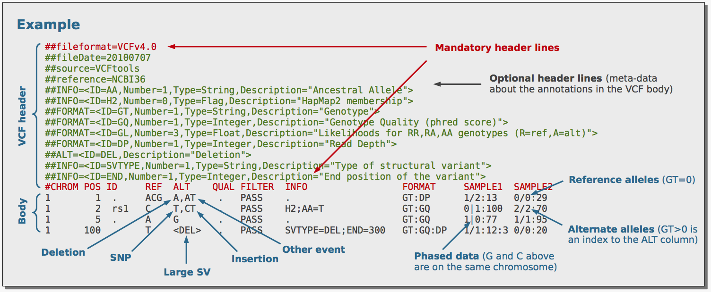
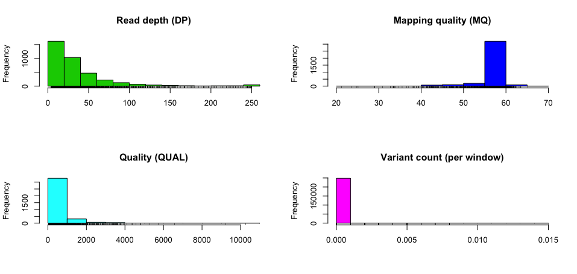
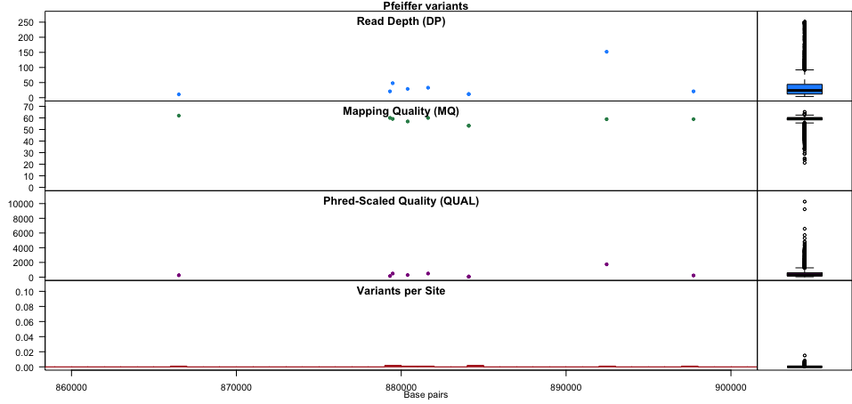

```{r setup, include=FALSE}
Sys.setenv( PATH=paste0(Sys.getenv("PATH"), ":", getwd(), "/tools/bin") )
knitr::opts_chunk$set(echo = TRUE)
```

## Introduction


Natural selection occurs under three conditions:

1. Genetic variation occurs among individuals (and this occurs mainly due to chance errors in replication)
2. The genetic variation must be heritable, i.e. passed from one generation to the next, and
3. The genetic variation results in varying fitness, i.e. individuals survive and reproduce with respect to genetic variation

The _de facto_ file format for storing genetic variation is the Variant Call Format (VCF) and was developed under the [1000 Genomes Project](https://pubmed.ncbi.nlm.nih.gov/21653522/). Currently, the Large Scale Genomics work stream of the Global Alliance for Genomics & Health (GA4GH) maintain the specification of the VCF (and other [high-throughput sequencing data formats](https://samtools.github.io/hts-specs/)). A good starting point for learning about the VCF is this [poster](http://vcftools.sourceforge.net/VCF-poster.pdf) and a portion of the poster is displayed below.



Initially, VCFtools (and the associated scripts) was used for working with VCF files. VCFtools was also developed by the 1000 Genomes Project team but the [tool](https://github.com/vcftools/vcftools) does not seem to be actively maintained anymore. As VCF files are simply tab-delimited flat files, they are slow to process and the BCF was implemented, which is a more efficient format for data processing. A BCF file is the binary equivalent of a VCF file, akin to the SAM and BAM formats and [BCFtools](https://github.com/samtools/bcftools) is used to work with BCF (and VCF) files. BCFtools is actively maintained and therefore should be used instead of VCFtools. To learn more about BCFtools (and SAMtools), check out the paper [Twelve years of SAMtools and BCFtools](https://academic.oup.com/gigascience/article/10/2/giab008/6137722) and please cite it if you use BCFtools for your work.

Lastly, this README is created by `create_readme.sh` on GitHub Actions, which executes `readme.Rmd` and creates `README.md`.

## Installation

The easiest way to install BCFtools is by using [Conda](https://docs.conda.io/en/latest/) (and I recommend using [Miniconda](https://docs.conda.io/en/latest/miniconda.html)).

```bash
conda install -c bioconda bcftools
```

It is also relatively straightforward to compile on Linux (if your system has all the prerequisites). The following code will install BCFtools (and HTSlib and SAMtools, which you will most likely be using as well) into the directory specified by `dir=`.

```bash
dir=$HOME/tools

ver=1.15
for tool in htslib bcftools samtools; do
   check=${tool}
   if [[ ${tool} == htslib ]]; then
      check=bgzip
   fi
   if [[ ! -e ${dir}/bin/${check} ]]; then
      url=https://github.com/samtools/${tool}/releases/download/${ver}/${tool}-${ver}.tar.bz2
      wget ${url}
      tar xjf ${tool}-${ver}.tar.bz2
      cd ${tool}-${ver}
      ./configure --prefix=${dir}
      make && make install
      cd ..
      rm -rf ${tool}-${ver}*
   fi
done
```

## Creating VCF example files

Example VCF files were generated to test the functionality of BCFtool and other VCF tools. The `aln.bt.vcf.gz`, `aln.hc.vcf.gz`, and `aln.fb.vcf.gz` VCF files were generated using a simple workflow implemented in [Groovy](http://www.groovy-lang.org/) and processed by [Bpipe](https://github.com/ssadedin/bpipe), a tool for running bioinformatics workflows. You can view the workflow in `workflow/simple/pipeline.groovy`, which carries out the following steps: (i) a random reference sequence is generated, (ii) the reference sequence is mutated, (iii) reads are derived from the mutated reference then (iv) mapped back to the original non-mutated reference (v) and finally variants are called using three separate tools: BCFtools, HaplotypeCaller, and freebayes. Additional information is available in this [blog post](http://davetang.org/muse/2015/06/04/paired-end-alignment-using-bpipe/).

To run this workflow for yourself, run the following commands:

```bash
git clone https://github.com/davetang/learning_vcf_file.git

# installs the necessary tools
cd workflow && ./install.sh

# run the workflow using Bpipe
cd simple && make
```

If you want to play around with different parameters, simply edit the variables at the start of `workflow/simple/pipeline.groovy`. The status of this workflow is checked by [GitHub Actions](https://github.com/features/actions) and on successful completion the final variant calls are copied to the `eg` folder; please refer to `.github/workflows/variant_call.yml` for more details.

## Usage

Running `bcftools` without any parameters will output the usage and the subcommands. (The `--help` option is used below to avoid an exit code of 1 since this README is generated programmatically.)

```{bash engine.opts='-l'}
bcftools --help
```

## Getting help

If BCFtools was [installed]($installation) by compiling the source code, you can simply run `man bcftools` to access the manual pages for getting help. If BCFtools was installed using `Conda`, the `MANPATH` environment variable [needs to be set](https://github.com/conda/conda/issues/845#issuecomment-525223443). The man pages provides additional information for each subcommand and its parameters.

```bash
man bcftools
```

## VCF to BCF and other conversions

Use `bcftools view` or `bcftools convert` to make conversions and use `--output-type u` or `--output-type b` for uncompressed and compressed BCF, respectively.

```{bash engine.opts='-l'}
bcftools view -O u eg/aln.bt.vcf.gz > eg/aln.bt.un.bcf
bcftools view -O b eg/aln.bt.vcf.gz > eg/aln.bt.bcf

# uncompressed VCF
bcftools convert -O v eg/aln.bt.vcf.gz > eg/aln.bt.vcf
```

`bcftools convert` has more conversion options such as converting gVCF to VCF and converting VCFs from `IMPUTE2` and `SHAPEIT`.

## Viewing a VCF/BCF file

Use `bcftools view` to view a VCF, bgzipped VCF, or BCF file; BCFtools will automatically detect the format.

Viewing a VCF file.

```{bash engine.opts='-l'}
bcftools view eg/aln.bt.vcf | grep -v "^#" | head -2
```

Viewing a bgzipped VCF file.

```{bash engine.opts='-l'}
bcftools view eg/aln.bt.vcf.gz | grep -v "^#" | head -2
```

Viewing a BCF file.

```{bash engine.opts='-l'}
bcftools view eg/aln.bt.vcf.gz | grep -v "^#" | head -2
```

If you want to omit the header but do not want to type `grep -v "^#"`, you can use the `-H` option instead.

```{bash engine.opts='-l'}
bcftools view -H eg/aln.bt.vcf.gz | head -2
```

## Comparing output types

The four output types will be compared on a VCF file produced by the 1000 Genomes Project.

1. Compressed BCF (b)
2. Uncompressed BCF (u)
3. Compressed VCF (z)
4. Uncompressed VCF (v).

Download and unzip.

```{bash engine.opts='-l'}
wget --quiet https://davetang.org/file/ALL.chr1.phase3_shapeit2_mvncall_integrated_v5_related_samples.20130502.genotypes.vcf.gz -O eg/1kgp.vcf.gz
gunzip eg/1kgp.vcf.gz
```

VCF to compressed BCF.

```{bash engine.opts='-l'}
time bcftools convert --threads 2 -O b -o eg/1kgp.bcf eg/1kgp.vcf
```

VCF to uncompressed BCF.

```{bash engine.opts='-l'}
time bcftools convert --threads 2 -O u -o eg/1kgp.un.bcf eg/1kgp.vcf
```

VCF to compressed VCF.

```{bash engine.opts='-l'}
time bcftools convert --threads 2 -O z -o eg/1kgp.vcf.gz eg/1kgp.vcf
```

File sizes

```{bash engine.opts='-l'}
du -h eg/1kgp.*
```

## Filtering for different types of mutations

Use the `bcftools view` subcommand to subset specific types of variants.

    -v/V, --types/--exclude-types LIST     Select/exclude comma-separated list of variant types: snps,indels,mnps,ref,bnd,other [null]

SNPs.

```{bash engine.opts='-l'}
bcftools view -v snps eg/1kgp.bcf | grep -v "^#" | cut -f1-8 | head -2
```

Indels.

```{bash engine.opts='-l'}
bcftools view -v indels eg/1kgp.bcf | grep -v "^#" | cut -f1-8 | head -2
```

[Multiple Nucleotide Polymorphisms](https://genome.sph.umich.edu/wiki/Variant_classification#Definitions): The reference and alternate sequences are of the same length and have to be greater than 1 and all nucleotides in the sequences differ from one another.

```{bash engine.opts='-l'}
bcftools view -H -v mnps eg/ex.vcf | grep -v "^#"
```

Not sure what `ref` refers to but possibly structural variants. `INS:ME` refers to an insertion of a mobile element relative to the reference and the `<CN#>` refers to `Copy number allele: # copies` according to the VCF header.

```{bash engine.opts='-l'}
bcftools view -v ref eg/1kgp.bcf | grep -v "^#" | cut -f1-8 | head -3
```

Breakends (no variants of this class).

```{bash engine.opts='-l'}
bcftools view -H -v bnd eg/1kgp.bcf
```

Others.

```{bash engine.opts='-l'}
bcftools view -v other eg/1kgp.bcf | grep -v "^#" | cut -f1-8 | head -3
```

## VCF to PED

See my [blog post](http://davetang.org/muse/2016/07/28/vcf-to-ped/).

## VCF to BED

VCF to [Browser Extensible Data](https://www.genome.ucsc.edu/FAQ/FAQformat.html#format1) format and not [Binary PED](http://zzz.bwh.harvard.edu/plink/data.shtml#bed) format; for Binary PED, see the `plink` directory in this repo. For Browser Extensible Data use [BEDOPS](https://bedops.readthedocs.io/en/latest/index.html), specifically the [vcf2bed](https://bedops.readthedocs.io/en/latest/content/reference/file-management/conversion/vcf2bed.html) tool.

Install using Conda from [Bioconda](https://anaconda.org/bioconda/bedops).

```bash
conda install -c bioconda bedops
```

Check out example file.

```{bash engine.opts='-l'}
cat eg/ex.vcf | grep -v "^#" | cut -f1-6
```

Convert to BED.

```{bash engine.opts='-l'}
vcf2bed < eg/ex.vcf | cut -f1-3
```

Note above that the deletion (rs57524763) only has 1 nucleotide but the reference should be 3 nucleotides long. Use `--deletions` to have the coordinates reflect the length of the reference sequence (and to only report deletions).

```{bash engine.opts='-l'}
vcf2bed --deletions < eg/ex.vcf | cut -f1-3
```

There is also the insertions option to report only insertions

```{bash engine.opts='-l'}
vcf2bed --insertions < eg/ex.vcf | cut -f1-3
```

To report SNVs use `snvs` but note the tool reports the MNP as a SNV and the reference length is not 2 nucleotides long.

```{bash engine.opts='-l'}
vcf2bed --snvs < eg/ex.vcf | cut -f1-3
```

## Extracting INFO field/s

The VCF has various information fields; use the `query` subcommand to extract specific field/s.

```{bash engine.opts='-l'}
bcftools query -f 'DP=%DP\tAN=%AN\tAC=%AC\tMQ=%MQ\n' eg/aln.bt.vcf.gz | head -3
```

Combining with the `view` subcommand:

```{bash engine.opts='-l'}
bcftools view -v snps eg/aln.bt.vcf.gz | bcftools query -f 'DP=%DP\tAN=%AN\tAC=%AC\tMQ=%MQ\n' - | head -3
```

## Filtering VCF on the FILTER column

Use `bcftools view` to keep variants that have a "PASS" in the FILTER column.

    -f,   --apply-filters <list> require at least one of the listed FILTER strings (e.g. "PASS,.")

```{bash engine.opts='-l'}
bcftools view -H -f PASS eg/1kgp.bcf | head -3
```

## Filtering VCF file using the INFO field/s

Use `bcftools filter` to filter out (`-e` or `--exclude`) variants. In the example below we are filtering out variants that have a depth of less than 200. We also use the `-s` parameter to name our filter and this name will be displayed in the `FILTER` column.

```{bash engine.opts='-l'}
bcftools filter -s "Depth200" -e "DP<200" eg/aln.bt.vcf.gz | grep -v "^##" | head -4
```

Use `&` to combine several other criteria.

```{bash engine.opts='-l'}
bcftools filter -s "Depth200&VDB" -e "DP<200 & VDB<0.9" eg/aln.bt.vcf.gz | grep -v "^##" | head -4
```

The `-e` or `-i` parameters accept an expression and we can use it to perform calculations. In the example below, variants with a QD divided by DP ratio of less than 0.3 are labelled with `QD/DP`; this ratio was created for illustrative purposes only. Note that `QD` and `DP` are prefixed with `INFO/`; this was done to explicitly state that we want the QD and DP values from the INFO field, since there is also a DP value in the FORMAT field. (This VCF file is different from the first filtering example, which only had one DP value.)

```{bash engine.opts='-l'}
bcftools filter -s "QD/DP" -e "INFO/QD / INFO/DP < 0.3" eg/aln.hc.vcf.gz | grep -v "^##" | head -4
```

## Summarise SNPs and INDELs per sample

Use `bcftools stats` with the `-s -` parameter. The example VCF file `eg/ex.vcf` has four variants across three samples (one, two, and three).

* Sample one has two SNPs (both het) and one deletion (het)
* Sample two has two SNPs (one het and one hom alt) and insertion (het)
* Sample three has one SNP (het) and one insertion (hom alt) and one deletion (hom alt)

You can confirm the numbers from the stats output.

```{bash engine.opts='-l'}
cat eg/ex.vcf | grep -v "^#"
```

```{bash engine.opts='-l'}
bcftools stats -s - eg/ex.vcf | grep -A 4 "Per-sample counts"
```

```{bash engine.opts='-l'}
bcftools stats -s - eg/ex.vcf | grep -A 4 "Per-Sample Indels"
```

## Add AF tag to a VCF file

The allele frequency tag (AF) is missing from the VCF file generated by `BCFtools call`.

```{bash engine.opts='-l'}
bcftools view -H eg/aln.bt.vcf.gz | head -1
```

The `fill-tags` plugin can add additional tags to a VCF file including the AF tag.

```{bash engine.opts='-l'}
bcftools plugin fill-tags eg/aln.bt.vcf.gz | grep -v "^#" | head -1
```

## Add custom annotations

The `annotate` function can be used to [add additional annotations](https://samtools.github.io/bcftools/howtos/annotate.html) to a VCF file. You can use a VCF file or a tabix-indexed tab-delimited file; if a tab-delimited file is used, an additional header file is required.

To demonstrate, a tab-delimited file with incremental integers (fifth column) is created.

```{bash engine.opts='-l'}
bcftools view -H eg/aln.bt.vcf.gz | head -3 | cut -f1,2,4,5 | perl -nle '$i++; print join("\t", $_, "$i")' > eg/test_anno.tsv
cat eg/test_anno.tsv
```

`eg/test_anno.tsv` needs to be tabix-indexed with the following parameters:

* `-s` specifies the column for sequence names
* `-b` specifies the column for region start/s
* `-e` specifies the column for region end/s

```{bash engine.opts='-l'}
bgzip eg/test_anno.tsv
tabix -s1 -b2 -e2 eg/test_anno.tsv.gz
```

Create header file.

```{bash engine.opts='-l'}
echo -e "##INFO=<ID=INC,Number=1,Type=Integer,Description=\"Increment number\">" > eg/test_anno.hdr
```

Add `INC` annotation.

```{bash engine.opts='-l'}
bcftools annotate -a eg/test_anno.tsv.gz -h eg/test_anno.hdr -c CHROM,POS,REF,ALT,INC eg/aln.bt.vcf.gz | grep -v "^##" | head -4
```

To add the custom annotations to the ID column of the VCF file, specify the ID column instead of the INFO tag with the `-c` parameter. (Note that we no longer require the header file, since the ID column is a standard column in the VCF.)

```{bash engine.opts='-l'}
bcftools annotate -a eg/test_anno.tsv.gz -c CHROM,POS,REF,ALT,ID eg/aln.bt.vcf.gz | grep -v "^##" | head -4
```

In addition, `annotate` can set IDs on-the-fly using information from the VCF columns using the `--set-id` parameter.

```{bash engine.opts='-l'}
bcftools annotate --set-id '%CHROM\_%POS\_%REF\_%FIRST_ALT' eg/aln.bt.vcf.gz | grep -v "^##" | head -4
```

## Check whether the REF sequence is correct

Change the reference sequence of variant at position 151 to G.

```{bash engine.opts='-l'}
zcat eg/aln.bt.vcf.gz | perl -lane 'if($F[1] == 151){ $F[3] = G; print join("\t", @F) } else { print }' > eg/incorrect.vcf
```

Use `bcftools norm` with `-c` to check whether the REF sequence is correct.

```{bash engine.opts='-l'}
bcftools norm -f eg/test_31.fa -c w eg/incorrect.vcf > /dev/null
```

## Random subset of variants

Total number of variants.

```{bash engine.opts='-l'}
bcftools view -H eg/aln.bt.vcf.gz | wc -l
```

A random sample can be achieved by using a Perl one-liner. In the example below, the `srand` function sets the seed (for reproducibility) and the float controls how many variants are outputted (1%). (Note that the use of `grep -v "^#"` is only line counting purposes.)

```{bash engine.opts='-l'}
bcftools view eg/aln.bt.vcf.gz | perl -nle 'BEGIN { srand(1984) } if (/^#/){ print; next }; print if rand(1) < 0.01' | grep -v "^#" | wc -l
```

Sub-sample 1% and save as BCF file.

```{bash engine.opts='-l'}
bcftools view eg/aln.bt.vcf.gz | perl -nle 'BEGIN { srand(1984) } if (/^#/){ print; next }; print if rand(1) < 0.01' | bcftools view -O b - -o eg/aln.bt.ss.bcf
```

Sample 10%.

```{bash engine.opts='-l'}
bcftools view eg/aln.bt.vcf.gz | perl -nle 'BEGIN { srand(1984) } if (/^#/){ print; next }; print if rand(1) < 0.1' | grep -v "^#" | wc -l
```

## Sorting

BCFtools has a `sort` function but the usage does not indicate the sorting order. We can create a subsetted and shuffled VCF file and check the order after sorting.

```{bash engine.opts='-l'}
bcftools view -h eg/Pfeiffer.vcf > eg/Pfeiffer_header.vcf
bcftools view eg/Pfeiffer.vcf | perl -nle 'BEGIN { srand(1984) } if (/^#/){ next }; print if rand(1) < 0.01' | shuf > eg/Pfeiffer_shuf.txt

cat eg/Pfeiffer_header.vcf eg/Pfeiffer_shuf.txt > eg/Pfeiffer_shuf.vcf

bcftools view -H eg/Pfeiffer_shuf.vcf | head
```

Sort.

```{bash engine.opts='-l'}
bcftools sort eg/Pfeiffer_shuf.vcf > eg/Pfeiffer_sorted.vcf
```

Check first 10 lines.

```{bash engine.opts='-l'}
bcftools view -H eg/Pfeiffer_sorted.vcf | head
```

Check chromosome order.

```{bash engine.opts='-l'}
bcftools view -H eg/Pfeiffer_sorted.vcf | cut -f1 | uniq
```

BCFtools sorts by lexical order (and there does not seem to be an option for another order).

If you use Linux, we can use the `sort` utility provided by your distribution instead of `bcftools sort`; we just need to separate and join the VCF header back. For this README, the following version of `sort` was used.

```{bash engine.opts='-l'}
sort --version
```

Sort using natural sort.

```{bash engine.opts='-l'}
sort -k1,1V -k2,2n eg/Pfeiffer_shuf.txt > eg/Pfeiffer_ns.txt
cat eg/Pfeiffer_header.vcf eg/Pfeiffer_ns.txt >  eg/Pfeiffer_ns.vcf
bcftools view -H eg/Pfeiffer_ns.vcf | cut -f1 | uniq
```

## Index a VCF file

An index is required for several tasks such as [subsetting variants](#subset-variants-within-a-specific-genomic-region). Using either `bcftools index` or `tabix` seems to be fine, although they generate indexes with different suffixes.

Using `bcftools index` to generate a `csi` index.

```{bash engine.opts='-l'}
bcftools index eg/aln.hc.vcf.gz
bcftools view -H -r 1000000:100-1000 eg/aln.hc.vcf.gz
rm eg/aln.hc.vcf.gz.csi
```

Using `tabix` to generate a `tbi` index.

```{bash engine.opts='-l'}
tabix eg/aln.hc.vcf.gz
bcftools view -H -r 1000000:100-1000 eg/aln.hc.vcf.gz
rm eg/aln.hc.vcf.gz.tbi
```

## Subset variants within a specific genomic region

Use `bcftools view` with `-r` or `-R`, which requires an index file. You can use `bcftools view` with `-t` or `-T`, which does not require an index file, but is much slower because the entire file is streamed.

```{bash engine.opts='-l'}
tabix -f eg/1kgp.bcf
time bcftools view -H -r 1:55000000-56000000 eg/1kgp.bcf | wc -l
```

`bcftools view` with `-t` streams the entire file, so is much slower.

```{bash engine.opts='-l'}
time bcftools view -H -t 1:55000000-56000000 eg/1kgp.bcf | wc -l
```

Use commas to list more than one loci.

```{bash engine.opts='-l'}
bcftools view -H -r 1:10000-50000,1:100000-200000,1:55000000-56000000 eg/1kgp.bcf | wc -l
```

Or use a BED file to store regions of interest.

```{bash engine.opts='-l'}
echo -e "1\t10000\t50000\n1\t100000\t200000\n1\t55000000\t56000000" > eg/regions.bed
bcftools view -H -R eg/regions.bed eg/1kgp.bcf | wc -l
```

## Output sample names

Use `bcftools query`.

```{bash engine.opts='-l'}
bcftools query -l eg/1kgp.vcf.gz | head -5
```

## Rename sample names

Use `reheader` to rename samples in a VCF using a text file containing the new sample names (one per line). Note that the default output format for `reheader` is BCF (with no option for another format).

Old sample names.

```{bash engine.opts='-l'}
bcftools query -l eg/1001genomes_snp-short-indel_only_ACGTN_5000.vcf.gz | head -5
```

Rename VCF file using new sample names in `eg/sample_name.txt`.

```{bash engine.opts='-l'}
num_sample=$(bcftools query -l eg/1001genomes_snp-short-indel_only_ACGTN_5000.vcf.gz | wc -l)
for (( i = 0 ; i < ${num_sample} ; i++ )); do echo ${i}; done > eg/sample_name.txt

bcftools reheader -s eg/sample_name.txt eg/1001genomes_snp-short-indel_only_ACGTN_5000.vcf.gz | bcftools view -h - | tail -1
```

## Subset sample/s from a multi-sample VCF file

Subset HG00733.

```{bash engine.opts='-l'}
bcftools view -s HG00733 eg/1kgp.vcf.gz | grep -v "^##" | head -3
```

Subset HG00124, HG00501, HG00635, HG00702, and HG00733.

```{bash engine.opts='-l'}
bcftools view -s HG00124,HG00501,HG00635,HG00702,HG00733 eg/1kgp.vcf.gz | grep -v "^##" | head -3
```

## Concatenate VCF files

Concatenating is similar to joining VCF files in a row-wise manner. This only works for VCF files with the same samples that are also organised in the same order.

If we concatenate `eg/aln.bt.vcf.gz` and `eg/aln.hc.vcf.gz` we would expect that the total number of variants is the sum of both.

```{bash engine.opts='-l'}
expr $(bcftools view -H eg/aln.bt.vcf.gz | wc -l) + $(bcftools view -H eg/aln.hc.vcf.gz | wc -l)
```

Perform the concatenation with default settings and count the number of variants.

```{bash engine.opts='-l'}
bcftools concat eg/aln.bt.vcf.gz eg/aln.hc.vcf.gz  | bcftools view -H - | wc -l
```

Removing duplicates requires indexed VCF files; the `-f` parameter is used with `bcftools index` to overwrite an index if it exists.

```{bash engine.opts='-l'}
bcftools index -f eg/aln.bt.vcf.gz
bcftools index -f eg/aln.hc.vcf.gz
```

To remove duplicates (`-D`) we need to allow overlaps (`-a`).

```{bash engine.opts='-l'}
bcftools concat -a -D eg/aln.bt.vcf.gz eg/aln.hc.vcf.gz  | bcftools view -H - | wc -l
```

## Merging VCF files

Use `bcftools merge` to merge VCF files. [In this workflow](https://github.com/davetang/sars_cov_2/blob/master/.github/workflows/omicron_variants.yml), `bcftools merge` was used to create a multi-sample VCF file from individual VCF files.

```bash
bcftools merge -o PRJNA784038_illumina.vcf -O v SRR*.vcf.gz
```

## Decomposing and normalising variants

Decomposing can refer to the splitting of multi-allelic variants; we can use `bcftools norm -m` for this.

```{bash engine.opts='-l'}
bcftools view -H eg/PRJNA784038_illumina.vcf.gz | head -2 | cut -f1-5
```

Splitting.

```{bash engine.opts='-l'}
bcftools norm -m- eg/PRJNA784038_illumina.vcf.gz | grep -v "^#" | head -3 | cut -f1-5
```

Decomposing can also refer to converting MNVs into consecutive SNVs; this is achieved with `bcftools norm -a`.

```{bash engine.opts='-l'}
bcftools view -H eg/ex.vcf  | tail -1
```

Convert MNV into SNVs.

```{bash engine.opts='-l'}
bcftools norm -a eg/ex.vcf | tail -2
```

Finally, there is also left-aligning, which will be clear by viewing an example.

```{bash engine.opts='-l'}
bcftools view -H eg/aln.bt.vcf.gz | head -2
```

Left-align.

```{bash engine.opts='-l'}
bcftools norm -f eg/test_31.fa eg/aln.bt.vcf.gz | grep -v "^#" | head -2
```

Decomposing and normalising variants are very important steps when comparing VCF files.

## Comparing VCF files

BCFtools has an intersect tool (`bcftools isec`) that is useful for comparing VCF files; the tool requires an index.

```{bash engine.opts='-l'}
tabix -f eg/aln.bt.vcf.gz
tabix -f eg/aln.hc.vcf.gz

bcftools isec eg/aln.bt.vcf.gz eg/aln.hc.vcf.gz -p comp
```

Four VCF files are produced and `README.txt` explains the contents of each VCF file.

Records private to `eg/aln.bt.vcf.gz`.

```{bash engine.opts='-l'}
bcftools view -H comp/0000.vcf | wc -l
```

Records private to `eg/aln.hc.vcf.gz`.

```{bash engine.opts='-l'}
bcftools view -H comp/0001.vcf | wc -l
```

Number of overlap.

```{bash engine.opts='-l'}
bcftools view -H comp/0002.vcf | wc -l
```

[SnpSift](http://snpeff.sourceforge.net/SnpSift.html) is also useful for comparing VCF files for checking their [concordance](http://davetang.org/muse/2015/08/26/vcf-concordance/).

## Visualisation

The [vcfR](https://cran.r-project.org/web/packages/vcfR/index.html) package produces some nice plots.

```r
install.packages("vcfR")
library(vcfR)

my_vcf <- read.vcfR("~/github/learning_vcf_file/eg/Pfeiffer.vcf", verbose = FALSE)
chrom <- create.chromR(name="Pfeiffer variants", vcf=my_vcf)
chrom <- proc.chromR(chrom, verbose=TRUE)

plot(chrom)
```



```r
chromoqc(chrom, xlim=c(860000, 900000))
```



## Useful links

* A very useful thread on SEQanswers on learning about the VCF format: <http://seqanswers.com/forums/showthread.php?t=9345>
* Useful tutorial on VCFs files from the 1000 Genomes Project Page: <http://www.1000genomes.org/node/101>
* The author of ANNOVAR writes about VCF files: <http://annovar.openbioinformatics.org/en/latest/articles/VCF/>
* [Encoding Structural Variants in VCF](http://www.1000genomes.org/wiki/Analysis/Variant%20Call%20Format/VCF%20(Variant%20Call%20Format)%20version%204.0/encoding-structural-variants) version 4.0
* [BCFtools cheat sheet](https://gist.github.com/elowy01/93922762e131d7abd3c7e8e166a74a0b)

## Stargazers over time

[](https://starchart.cc/davetang/learning_vcf_file)

